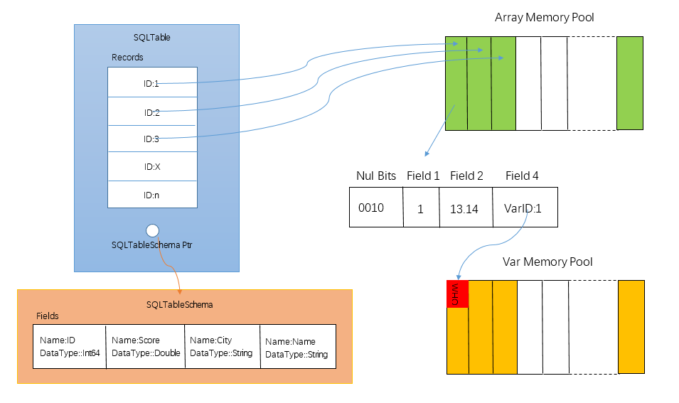
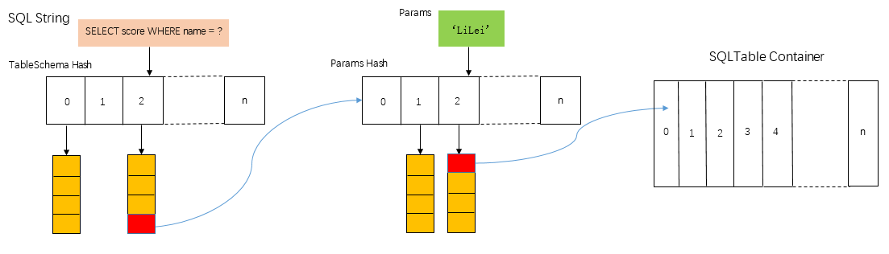
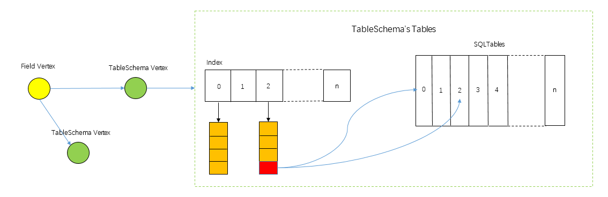
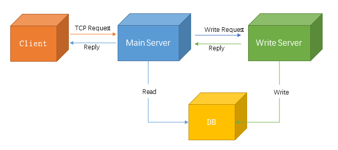
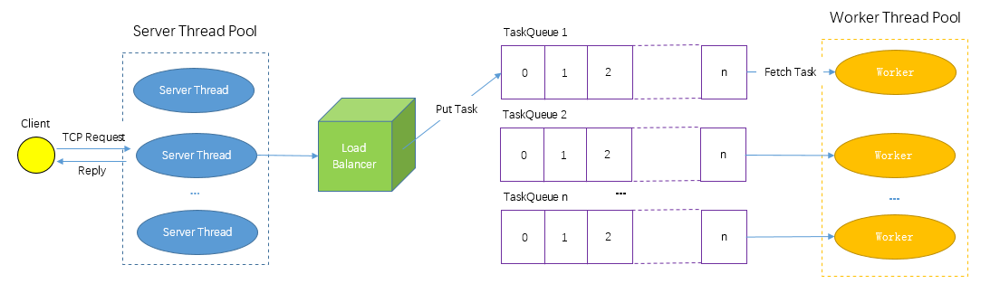
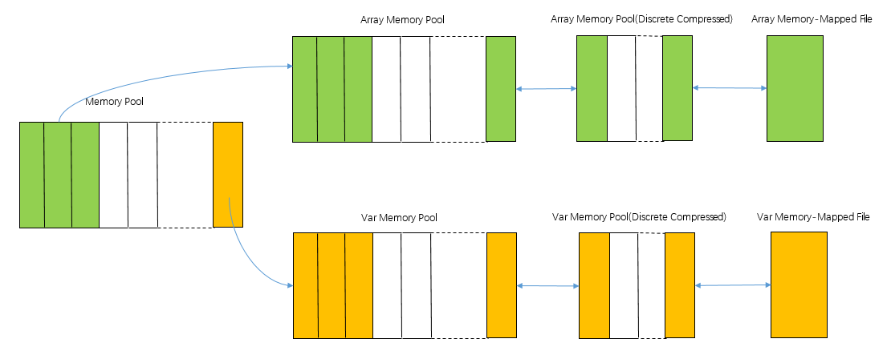

This is a SQL Cache Server For All RDBMS including mysql, PostgreSQL,Oracle

1.	What is MySQLCache? What is the purpose of developing this Software System?
   
MySQLCache is a general Cache For all kinds of RDBMS, is a MiddleWare connect Backend Application with RDBMS.

MySQLCache is a Cache System, Import it, Backend Application access RDBMS through MySQLCache rather than directly access RDBMS.

Compare MySQLCache with Redis: 

Redis is a general Cache System in Backend Applications, it can cache everything(usually not big Data) in memory,MySQLCache only cache the SELECT result from RDBMS mostly in memory。

Compare MySQLCache with Builtin cache in RDBMS:

Builtin cache is Fixed(can’t modify)，once the table refered has any data change, the cache For Select With the table is invalidate。This strategy is simple but low efficient，thus Builting cache is almost unusable。In MySQL8.0 or Higher version, QUERY CACHE is forbidden。

MySQLCache is mutable(can modify)。Most of data change of the table refered is incremently applied to Cache Result in real time, efficiently。

Back to the question: What is the purpose of develop MySQLCache?

Provide a Efficient、Stable and High Avaible Cache System for all kinds of RDBMS(Currently only support MySQL, while Oracle, Sql Server, PostgreSQL is in the plan).

2.	How to implement MySQLCache?

This is a very difficult and complicated problem.The big problem can be divided into four small problem:

2.1	How to store SELECT result?

In Select Statement, most used grammar includes:FROM, WHERE, ORDER BY, JOIN, GROUP BY, HAVING.In first version of MySQLCache, only support these grammar(and only support two join tables), while more supports are in the plan.

This chapter will discuss how DDL operations effect SELECT result, in Example of grammar above mentioned.

Above all, we first should define SELECT result.The result is a virtual table or temp table, most of Fields is the same to real Table in database.So we define class SQLTable for SELECT result, SQLTable owns one schema(define by class SQLTableSchema) which contains definitions of all SELECT Fields(define by class SQLFieldSchema).SQLTable has Records(define by class SQLRecord).One Record has a fixed length memory block to store data from Database。For var length Field, the block emplace a ID(Integer type) in its position, the real var content related with ID is store in Var Memory Pool. The following picture show SQLTable structure in details.

 
 
                                                     Picture 1 Structure Of SQLTable
  	
Record’s memory is allocated from Array Memory Pool, which improve management for fix length memory block(More precisely, fix length in single SQLTable, not SQLTables).SQLTable only contains IDs provided from Pool.

When read and write Record’s content, Memory Pool provides reader and writer by ID to do this efficiently.Why use ID, not memory address?Because Memory Pool may change:compressed or write to disk(described in subsequent chapters).Only ID is unchanged.

String and Blob Field has variant byte length.In Record’memory block, emplate ID to represent it.Like Array Memory Pool, Var Memory Pool provides reader and writer by ID.

In Record’s header, is Nul Bits for fields, one bit for one field to indicate field value is null or not(1 for null, 0 for not)。Field values is placed directly after Null Bits.When field is null, there is no place for the field.

SQLTable contains a pointer to SQLTableSchema.SQLTableSchema defines schema of SQLTable.Fields is a array of Field Schemas.Field Schema defines name, dataType…of field.

Store SQLTables is a key question.When SELECT statement come in, we should quickly find the SQLTable corresponding to the SELECT result or not exist.

In most situations,SELECT is same in structure, different in parameters:

ex.（1）SELECT score FROM student WHERE name = ‘LiLei’ 

(2) SELECT score FROM student WHERE name=’Jim’

The two SELECT’ structure is: SELECT score FROM student WHERE name = ?  (Character ? is placeholder for parameter)

SELECT(1) has parameter: ‘LiLei’ SELECT(2) has parameter: ‘Jim’

So, how to design SQLTable container? 

Basically, there is a simple,direct implementation:Map.Key of map is sql string, value is SQLTable.how about this?

There are two disadvantages: 

(1)	Too many key, too large map

(2)	SQL is not a string in some case to prohibit SQL injection.

So the implemention is not applicable.

Picture 2 is the answer container.

  
                                               
											   Picture 2 Two-Level SQLTable Hash
                                      
There are two level hashs.First level is TableSchema Hash, which store SQL string without params as key, SQLTableSchema and a corrensponding Param Hash as value. After First Level, find SQLTableSchema and Param Hash(if not exist, create them).Second Level is Param Hash, which store Params as key, ID for SQLTable as value.After Second Level, find SQLTable ID which is Identifier in a container named SQLTable Container.All SQLTables is managered in this Container.If SQLTables is too many so that memory is out of used, then some SQLTables will be compressed.

If SQLTable matching params doesn’t exits, a new SQLTable is created, using SQLTableSchema finded in first level hash as its tableSchema.

2.2	How to incremently apply data change of table?

SQLTable is created and data is readed from DB in the first visit.Return it to application, and SQLTable can live in memory forever untils out of memory.

This chapter discuss how INSERT,UPDATE,DELTE statement affect these SQLTables.

SELECT usually has WHERE clause, it is a condition: in DB, it is used to filter the proper records; in my case, it is used to filter the proper SQLTables.Create index on the WHERE condition to highly promote filter progress.ex. SELECT score FROM student WHERE name = ? , in this sql, we can create index on the field:name.ex. find name==’LiLei’ in index, we find SQLTable for sql(SELECT score FROM student WHERE name = ‘LiLei’).The index not only support =, but also < ,>,between…The index focues at one field, not union index.For sql: SELECT score FROM student WHERE name = ? AND sex = ?，index field is name, not name,sex.
How to use index?There are records INSERT/DELETE/UPDATE, how to find matching SQLTables? First, we need fetch all field values of Records, then search index field value of Records in index, finally, search results is SQLTables after matching.
 We use index to do most of filter, then the filtered records are to be matched by whole WHERE condition one by one.
 
Data Change is at least Field Level. UPDATE is obviously at this level. INSERT and DELETE is ‌equivalent to UPDATE every Field in Record.Picture 3 show the procedure to find affected SQLTables.

  
  
                                   Picture 3 Procedure to find affected SQLTables
                                   
When record’s field changed, through the left graph, find field vertex. Field Vertex has directed edge to TableSchema Vertex. The edge is created while the creating of TableSchema.Execute SELECT for this TableSchema on the first time, we analyze dependent field schemas in the TableSchema.ex. SELECT score FROM student WHERE name = ? , depends on fields: score, name.Then add two Field Vertexs and TableSchema vertex in the graph, add a edge from field vertexs to tableSchema vertex. Need to emphasize that the field is not part of SELECT TableSchema, but of TableSchema Student in DB.That mean, for example, TableSchema for another SELECT:SELECT score, name FROM student, has same dependent field schemas in the graph.

TableSchema vertex, stores TableSchema’s Tables(Table IDs). If index memtioned above exist, use it for search above all. If not, directly match all SQLTables for the SQLTableSchemas one by one.The relation between SQLTables and SQLTableSchemas is very similar to Records and Table in DB.

SQLTable’s records must have Primary Key value(usually int64 type), this is a base requirement.If DB table doesn’t has PK, the table is not applicable for Cache.In mysqlCache, we can indicate SELECT result directly from DB(no cache).

2.2.1	INSERT

INSERT statement includes all field values of Record except PK(Primary Key).In MySQL, do ‘SELECT LAST_INSERT_ID()’ to get PK of last inserted Record(If INSERT several Records, get PK of first inserted Record among these).So we have all values for INSERT records.After procedure Picture 3 show, matched SQLTables are obtained.For each SQLTable, insert new Records into the table. According to kind of table, different things need to do:

（1）	Normal Table
Normal table is table whose data is from one table in DB.For normal table, for each inserted new DB record, we insert new Table record, and assign field value from DB record to Table record by field name.

（2）	Join Table
Join Table is table whose data is from two join tables in DB.JoinTable consists of two normal table. Each normal table contains records joined from one table in DB. Assume they are Table A and Table B.

For each inserted new DB record(assure Table A record), we should do a SELECT to find Records from Table B match this join.If Table B records exist, insert these Table B records into NormalTable B, insert Table A record into NormlaTable A, and build join relation between them. If Table B records not exist, do nothing. 

（3）	Aggregation Table
Aggregation Table is table whose data is aggregation from one or serveral tables.It is very expensive to update Aggregation Table, because aggreagion sql usually operate on all records of DB table.It is not wise to store all Records in Memory. So don’t change the Table, just discard the Table.

2.2.2	DELETE

To match SQLTables, it is necessary to know every field values of DELETE records.To do this, DELETE statement splits into two statement: 

(1)	SELECT with DELETE WHERE clause

Ex. DELETE FROM student WHERE name=’LiLei’, the first SELECT statement is : SELECT * WHERE name = ‘LiLei’.Through select, we get every field values of DELETE records, including PK.

(2)	DELETE by PKs.

Because DELETE records’s PKs are given, assuming PKs are 1,2,3, then the second DELETE statement is: DELETE FROM student WHERE id in (1,2,3). This DELETE is much faster than Original DELETE.
Now we do change to SQLTables.Similar to INSERT, do procedure of Picture 3, matched SQLTables are obtained.For each SQLTable, remove DELETE Records from the table.
			 
（1）	Normal Table

For each deleted DB record, remove SQLTable record by PK.

（2）	Join Table

JoinTable consists of two normal table, assume they are Table A and Table B.

For each deleted DB record(assure Table A record), remove it from Table A by PK, and remove join relation with the record.

（3）	Aggregation Table

Discard the Table.

2.2.3	UPDATE

Similar to DELETE, UPDATE statement splits into two statement:

（1）	SELECT with UPDATE Where clause

Ex. UPDATE student SET score=100 WHERE name=’LiLei’, SELECT statement is: SELECT * WHERE name = ‘LiLei’.Through select, we get every field values of UPDATE records, including PKs.

（2）	UPDATE by PKs

Assuming PKs are 1,2,3, the second UPDATE statement is: UPDATE student SET score=100 WHERE id in (1,2,3).

Do change to each matched SQLTable.The change is much different depends on whether UPDATE field exist in SQLTable’s WHERE clause(Including JOIN ON).

Ex. SELECT * FROM student WHERE score > 90, after do UPDATE above, update Records match SELECT, and need to be inserted into target SQLTable.But SQLTable maybe already contains it or not.If update Record
Has score>90 before UPDATE, SQLTable contains it before, so no need to insert.If not, insert the Record.

Ex.SELECT * FROM student WHERE score < 90, update Records don’t match SELECT. But procedure of Picture 3 can only find matched ones.If update Record has score<90 before UPDATE, need to remove Record from target SQLTable.

How to solve this problem? There is a solution easy to understand, both efficiently.

Use field values before UPDATE, do procedure of Picture3, find matched SQLTables, remove these Records from SQLTables like DELETE statement.

Use field values after UPDATE, do procedure of Picture3, find matched SQLTables, insert these Records into SQLTables like INSERT statement.

If UPDATE field doesn’t exist in SQLTable’s WHERE clause, do as below:

（1）	Normal Table

For each record, update SQLTable record’s target field values by PK.

（2）	Join Table

JoinTable consists of two normal table, assume they are Table A and Table B.For each record(assure Table A record), update SQLTable A record’s target field values by PK.

（3）	Aggregation Table

Discard the Table.
			 
3	How to keep data consistent between Cache and RDBMS? 

The System Architecture of MySQLCache is shown by Picture 4.
  
   
                                                 Picture 4 System Architecture 
               
Normally, MySQLCache is a standalone middleware, not distributed‌.Because distribute machines increase the complexity to keep Data Consistent and reduce efficiency of cache, so I don’t recommend distributed deployment unless necessary(However, Distributed Cache is supported in the near future, not now).

MySQLCache can maintain SQLTables as many as possible, even if out of memory, SQLTables can be compressed, write to Memory-mapped file.And MySQLCache can be setting to restart once SQLTables is too many so that search become inefficient. Restart is hot, just stop the process, and start new one.(However, restart is not implemented now)

MySQLCache split READ and WRITE. Main Server communicates with Client, process all requests and reply to client. If request need to Write DB, Main Server will send Write Request to Write Server. Write Server do as Write Request describe, and Reply to Main Server.The reply includes not only Write Result from DB, but also Data needed for updating SQLTables in MainServer. Then MainServer reply to client. It is very necessary to split READ and WRITE: WRITE is slow and not frequently, READ is fast and frequently, so that READ is not slown by WRITE.

The Runtime Architecture is shown below by Picture 5.

  
  
                                                  Picture 5 Runtime Architecture
                                
The Runtime Architecture is applicable for both MainServer and WriteServer(WriteServe only has one Server Thread).Server Thread receive TCP request from Client, parse the request and create Task for it. 

Through Load Balancer, put the task into a TaskQueue which is not most busy, every TaskQueue has a corresponding worker thread to do task. 

For Select Task, Balancer calculate Hash Value(0~n-1, n is quantity of TaskQueues) by SQL string, put the task into TaskQueue indexed by Hash Value. It is a good strategy to avoid data racing. SQLTables with same SQLTableSchema are operated in one Worker Thread, so there is no need to lock for safe, and promote multi-thread efficiency.

But exception exist: If Worker Thread choosen has most tasks not finished, then the choice is discard, and another Worker Thread is choosen. But this doesn’t cause data racing.Enter another Worker Thread, another SQLTable is created and searched. So there is low possibily that two SQLTable for same SELECT exist in two Worker Thread. It doesn’t matter, just keep lock free is preferable.

To avoid memory racing, every Worker Thread has its own MemoryPool(Includes ArrayMemory Pool, VarMemory Pool, and Memory Pool that will discuessed soon).

Picture 6 is three-level Memory Architecture.
  
  
														Picture 6 Three-Level Memory Architecture
                                                        
Memory Pool provide memory used by Array Memory Pool and Var Memory Pool.When Array/Var Memory Pool is too full(memory used exceed the threshold), start compress. The two memory pool are composed by memory blocks with fixed length. Compress is discrete, every 128 blocks is compressed into one memory area(allocate by Memory Pool either).By default, all blocks are compressed. The compress algorithm must be very fast, not most compress ratio.In MySQLCache, use Snappy to do this. After compressed, memory used is about 1/7 of original. When one block is visited, only the memory area contains the block is uncompressed, also very fast, so that it looks like uncompressed.

Compress is not omnipotent, if after compressed, memory used still exceed threshold, do Memory-Mapping.Write memory blocks uncompressed to Memory-Mapped File.When one block is visited, read adjacent 128 Blocks from file once.By default, all blocks is written to Memory-Mapped File, this is very slow.So it is split into many tiny write Tasks. Once just put one task into TaskQueue of current worker.When the tiny task is finished, put another tiny task into TaskQueue until no more.

Look carefully at architecutes of MySQLCache, there is answer of this chapter: Data Consistency.

After write DB, Write Server send Data needed for updating SQLTables to Main Server. Main Server receive the Data, create UpdateTask for each worker thread.Once UpdateTask is in the taskQueue, the SELECT task after UpdateTask must contain the WRITE data, so keep data consistent with DB.In other words, only at the time between WriteDB and put UpdateTask in TaskQueue, SELECT can’t get WriteData.The duration that is not data consistent is quitely short, mainly depends on time consumed by TCP transfer from WriteServer to MainServer.So network deployment for the two Server is important for high availability and high efficiency.

4	What is Transaction Isolation Level?

MySQLCache support explict Transaction sql. Like sql of only one Statement(Auto commit), all Transaction statements will be done sequently in one Worker Thread as a whole Task, visit SQLTables in current Worker.There is no possibilty to modify SQLTables except the Transaction self.But Write DB operation in transaction still need to add extra UpdateTask, so SQLTables for current Worker is unchanged through Transaction.Transaction Isolation Level is RR(Repeatable Read).

5.  Build

There two Directorys:MySQLCache,sdk.

MySQLCache is main code in C++, build by cmake.

In this Directory, there is a Externals Directory, which contains third party libraries MySQLCache depends on:libevent, antlr,mysqlConnector.

Server part is mainly implemented by libevent.

Antlr is used to parse mysql sql statement.

mysqlConnector is for communicate with mysql Server.

These libraries shoud be builded before MySQLCache.

Build libevent by cmake both in windows and Linux.Please see README.md in LibEvent Directory.The code is download from github, you can download the latest one.

In directory:altlr4, is code of altlr(you can download newer antlr version from github).vs proj and CMakeLists.txt for c++ is in child directory:runtime/Cpp/runtime.

MySQLConnector can be downloaded from http://dev.mysql.com/downloads for Windows. For Linux, it is preferable to install directly from OS.

In Ubuntu, do command in bash: apt-get install libmysqlcppconn-dev.Then copy cpp header installed to mysql-connnector/include, because there are difference among different versions so that compile fail.
So you can download MySQLConnector code, but in my ubuntu, there is possibilty to compile fail with reason I don't known.

After dependency are prepared, build MySQLCache code by cmake.For Windows, Visual Studio Proj(2019) is there(at least C++17)

sdk is code to deal with MySQLCache in java for backend applicaiton.TestApplication.java tell all basic usages.TestApplication is all my tests until now.
Tests is not sufficient.So welcome more clever man to join to constribute development of MySQLCache.

6.Run

MySQLCache basically work standalone, but read-write split. There are two Cache Server, one is main, while the other is write.

Two server share same code, decided by start up parameter: -readMode:false. Defualt readMode is true, set false to start up write server.

Write Server should start up after Main Server, console output :connect server means connect Main Server success.

Server has a start up setting file named Cache.ini. All contents is like that below:
###

server-mode:read     #as same as start up parameter readMode

server-thread-count:8   # count of server threads

worker-thread-count:8  #count of worker threads

array-memory-limit:1073741824  #threshold to compress of arrayMemory Pool

array-memory-push-limit:1000000000 #threshold to write disk of arrayMemory Pool

var-memory-limit:1073741824  #threshold to compress of varMemory Pool

var-memory-push-limit:1000000000 #threshold to write disk of varMemory Pool

table-memory-limit:1073741824  #threshold to compress of TableContainer

write-buffer-default-memory:1048576  #init memory of buffer for write tmp data

memory-root-path:/var/tmp/ #write disk location of memory pool

server-addr:127.0.0.1  # addr of MainServer, use for Write Server to connect to

sql-server-addr:tcp://127.0.0.1:3306,root,123456,mydb  # mysql connect info, root is username, 123456 is password, mydb is database name

###

5.End

At last, MySQLCache is a weak child now. There are too many problems on functionality and efficiency, availability to solve.
Hey, man, welcome to join.

